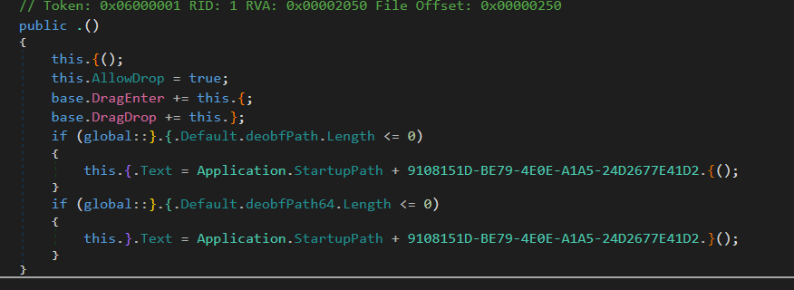
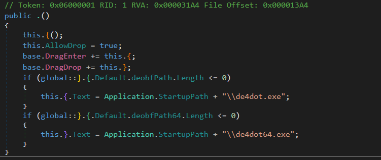

# Deobfuscar
 A simple commandline application to automatically decrypt strings from Obfuscator protected binaries.

 ## Usage

 `Deobfuscar.exe <input-file>`

 ## Showcase

 **Before:** Binary with encrypted strings

 

**After:**

